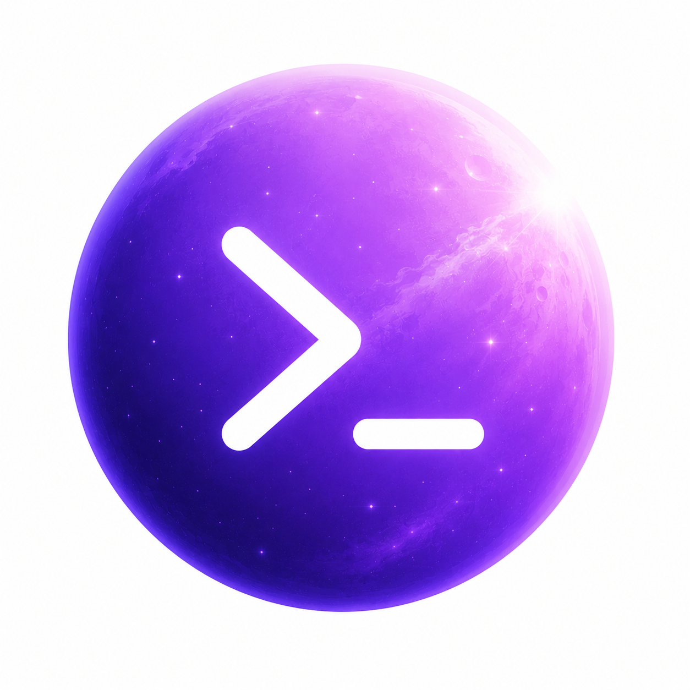

<div align="center">



<h1>NOVA&nbsp;CODE</h1>

<p><b>The terminal coding agent purpose-built for DeepSeek</b></p>

<p><code>95%+ cache hits</code> · <code>OS-sandboxed</code> · <code>tool-complete</code> · <code>install-and-go</code></p>

<p>
  <a href="https://www.npmjs.com/package/@asathinkeroops/nova-code"></a>
  
  
  <a href="LICENSE"></a>
</p>

<p>
  <a href="README.md">简体中文</a>
  &nbsp;·&nbsp;
  <b>English</b>
</p>

<p>
  <a href="#-why-nova"><b>Why Nova</b></a>
  &nbsp;•&nbsp;
  <a href="#-quick-start"><b>Quick Start</b></a>
  &nbsp;•&nbsp;
  <a href="#-features"><b>Features</b></a>
  &nbsp;•&nbsp;
  <a href="#-architecture"><b>Architecture</b></a>
  &nbsp;•&nbsp;
  <a href="#-development"><b>Development</b></a>
</p>

<br>


<br><sub>💬 Reads code, runs commands, edits files — drives your task to done in one terminal</sub>

</div>

<br>

Nova reads code, runs commands, edits files — and drives your task to done through tool use. It's built around **DeepSeek**: thinking maps to effort (not `budget_tokens`), error codes are translated into plain language, and balance and pricing are built in — with the entire request pipeline tuned so DeepSeek's automatic context cache keeps hitting. Every provider speaks the Anthropic-compatible protocol; a **provider profile** (selected by `settings.provider`) absorbs the per-vendor quirks — thinking shape, error tables, balance probe. DeepSeek is the primary target, Kimi (Moonshot) has a dedicated profile (beta), and any other endpoint falls back to the generic `other` tier.

<br>

## ✨ Why Nova

<table>
<tr>
<td width="50%" valign="top">

### ⚡ DeepSeek-native, zero config

No `cache_control` to tweak, no error-code docs to dig through. Install, drop in your key, go. Thinking maps to DeepSeek's `effort` (not `budget_tokens`), HTTP error codes are translated into plain language, and your account balance shows live on the status line — all tuned for DeepSeek out of the box.

</td>
<td width="50%" valign="top">

### 🎚️ More than DeepSeek: three-tier ladder

Three built-in provider profiles — DeepSeek, Moonshot (Kimi), and generic Anthropic-compatible — each with its own error-code table, rate-limit retries, and balance probe. Models are configured across `lite` / `pro` / `max` tiers, each with its own id, thinking level, and pricing. `/model` and `--model` switch the tier, not a raw provider id.

</td>
</tr>
<tr>
<td width="50%" valign="top">

### 🚀 Cache-friendly by design

History is append-only and the request body stays byte-stable (internal `meta` fields are stripped before sending so they never pollute the prefix); memory and skills are rebuilt only at session boundaries, never mid-turn — keeping DeepSeek's server-side prefix cache hitting every turn. Auto-compaction fires at half the context window and only appends a `<compacted>` boundary.

</td>
<td width="50%" valign="top">

### 🔒 OS-level sandbox, one line to enable

Turn it on and subprocess (`bash` / background tasks) writes are confined to the workspace by an OS-level sandbox (macOS Seatbelt / Linux bubblewrap), layered on top of the permission engine — writes only; reads and network stay open. Off by default — flip `sandbox.enabled: true` (or `/sandbox on` in-session) to opt in; unsupported platforms degrade silently.

</td>
</tr>
<tr>
<td width="50%" valign="top">

### 🧩 Extend with markdown, package as plugins

Define custom sub-agents, slash commands, skills, or lifecycle hooks — drop a `.md` file with frontmatter and you're done. No code changes, ships with the repo. To share a whole bundle, install it as a plugin: `nova plugin install` from a local path, GitHub repo, git url, or marketplace — Claude Code plugin-format compatible.

</td>
<td width="50%" valign="top">

### 🤖 Built for automation

`nova -p` runs a single non-interactive turn and exits; pair it with `--output-format json` to wire into scripts and CI. `/review <PR#>` reviews a GitHub PR read-only via `gh`; `cronCreate` fires a prompt on an interval or cron expression (re-armed on `/resume`); `/goal` sets a success condition and drives itself until it's met.

</td>
</tr>
<tr>
<td colspan="2" valign="top">

### 🔄 Bring your habits, not a manual

Nova closely mirrors the Claude Code workflow — the same slash commands, keybindings, approval prompts, three-layer memory files, and replayable sessions. If you've used Claude Code there's nothing new to learn: install and keep working the way you already do, just on an engine tuned for DeepSeek underneath.

</td>
</tr>
</table>

<br>

## 🚀 Quick start

> [!NOTE]
> Requires **Node ≥ 20**

```bash
npm install @asathinkeroops/nova-code -g
nova                               # launch the REPL
nova -p "explain this code"        # headless: one turn, print & exit
nova upgrade                       # update to the latest version (also auto-checked at startup)
```

First launch walks through an interactive setup (API key, model, etc.) → `~/.nova/nova.config.json`. Models are configured as a `lite` / `pro` / `max` ladder, each tier with its own thinking level and pricing (`models.<tier>.pricing`, USD / CNY); `/model` and `--model` switch tiers, not raw provider ids. The default provider is `deepseek`; set `settings.provider` to `moonshot` (Kimi, beta) or the generic `other`.

### 📦 More subcommands

| Subcommand | What it does |
| --- | --- |
| `nova doctor` | Health-check the global config |
| `nova mcp` | Manage MCP servers |
| `nova plugin` | Install / enable / disable plugins |
| `nova upgrade` | Update the CLI |

<br>

## 🛠️ Features

### Built-in tools

Tools the model can call — covering read/write, search, execution, code intelligence, and the web:

| Tool | Capability |
| --- | --- |
| `read` / `write` / `edit` | Read files (line-numbered + paginated, incl. `.xlsx` / `.ods` spreadsheets; images on image-capable model tiers), whole-file write, exact-text replace |
| `glob` / `grep` | Filename matching, full-text regex search |
| `bash` | Run shell commands |
| `runInBackground` / `getBackgroundOutput` / `killBackground` | Run long tasks (dev servers, watchers) in the background |
| `lsp` | Code intelligence: go-to-definition, references, hover, diagnostics, symbol search |
| `webfetch` / `websearch` | Fetch web pages, search the web |
| `createTodo` / `updateTodo` / `getTodoList` / `clearTodoList` | In-session multi-step checklist |
| `createTask` / `updateTask` / `getTaskList` / `clearTaskList` | Cross-session task plan with dependencies |
| `askUserQuestion` | Ask the user multiple-choice questions and wait for answers |
| `cronCreate` / `cronList` / `cronDelete` | Schedule a prompt or `/command` on an interval or cron expression; live within a session and re-arm on `/resume` |
| `loadSkill` | Load a skill on demand |

### ⌨️ Built-in commands

| Command | Capability |
| --- | --- |
| `/help` | See all commands |
| `/model` · `/effort` | Switch model tier (lite/pro/max), adjust the thinking level |
| `/compact` | Summarize long history |
| `/clear` · `/resume` · `/rewind` | Start a fresh session, resume a past one, roll back history |
| `/rename` | Give the current session a custom name (shown on the input frame) |
| `/plan` | Investigate read-only and produce an implementation plan |
| `/goal` | Set a success condition and auto-work toward it until met |
| `/diff` · `/review` | Browse and review uncommitted changes; `/review <PR#\|#PR\|github-pr-url>` reviews a GitHub PR read-only via the `gh` CLI |
| `/init` | Analyze the codebase to generate `NOVA.md` |
| `/agents` · `/agent` | See sub-agent types, delegate a task |
| `/nova-code-guide` · `/nova-code-guide-update` | Read-only Q&A agent about Nova itself; the latter pulls the newest source |
| `/commands` · `/skills` · `/mcp` · `/lsp` · `/plugin` | See registered commands, skills, MCP servers, language servers, loaded plugins |
| `/sandbox` | Enable/disable the OS command sandbox for this session (`on` / `off`) |
| `/loop` | Re-run a prompt or command on an interval (`/loop <interval> <prompt\|/cmd>`, `/loop stop` to end) |
| `/doctor` | Health-check the global config (JSON/schema, model/key, hooks, MCP), report issues, optionally hand them to the agent to fix in place |
| `/usage` · `/context` | See token usage, cache hits, context fill |
| `/tasks` | View and manage background commands (`runInBackground`) — list / stop |
| `/predict` | Toggle next-input prediction |
| `/exit` · `/quit` | Quit |

### Core capabilities

| Capability | What it gives you |
| --- | --- |
| 🧠 Sub-agents | Work with fresh context and their own tool set: `explore` (read-only retrieval), `plan` (read-only planning), `general-purpose` (full access), `nova-code-guide` (Q&A about Nova), plus custom types; each agent can run on its own model tier via `subagent.model` |
| 🛡️ Permissions & sandbox | <kbd>shift</kbd>+<kbd>tab</kbd> cycles `default` / `acceptEdits` / `auto` / `plan`; an OS-level sandbox confines subprocess writes to the workspace (macOS Seatbelt / Linux bubblewrap), off by default and one flag to enable |
| 📄 File guarding | Files must be read before they're edited, and external changes are detected — no accidental clobbering |
| 🔌 MCP | Connect external MCP servers (`stdio` / `http` / `sse`) and use their tools like built-ins, under the same permission gating |
| 📚 Skills | Write reusable playbooks as `SKILL.md`, loaded on demand by the model — token-cheap and distributable with the repo |
| 📝 Markdown extensions | Custom slash commands, sub-agents, and lifecycle hooks: drop a `.md` into `.nova/`, configure via frontmatter, no code changes |
| 🧩 Plugins | `nova plugin` installs / enables / disables plugins from a local path, GitHub, git url, or marketplace; one plugin can contribute commands, agents, skills, hooks, MCP / LSP servers, and `bin/` executables, in the Claude Code-compatible plugin format |
| 🗂️ Three-layer memory | Global → user → project, loaded by `NOVA.md` > `CLAUDE.md` > `AGENTS.md` priority |
| 💻 TUI | Full-screen Ink/React REPL, streaming output + mouse; `@path` / `/` completion, <kbd>↑</kbd> <kbd>↓</kbd> history; live status line with token usage, cache hits, cost, provider balance (DeepSeek / Kimi), git branch, context fill |

<br>

## 🏗️ Architecture

At Nova's core is a single model loop (`agentLoop`) with **one extension point** — a typed `HookRegistry`. Permission gating, compaction, transcript writing, and UI updates all attach as hooks at named lifecycle points; `@nova/core` itself imports no model SDK, tool implementation, or UI. Blocking hooks (◆) can rewrite or veto a step; advisory hooks (○) only observe.

<div align="center">
  
</div>

### 📁 Repository layout

```
packages/
  core           agent loop · model client · HookRegistry · message/stop-reason types
  agent          createAgent: per-turn driver + persistence + transcript wiring
  runtime        settings (zod) · pino logger · session storage
  tools          ToolRegistry · dispatcher · built-in tools
  subagent       createSubAgent tool · sub-agent definitions/registry/loader
  context        3-layer memory (NOVA.md > CLAUDE.md > AGENTS.md) · auto compact
  safety         PermissionEngine · approval prompts
  sandbox        OS-level command sandbox (write isolation)
  lsp            LSP client/manager (JSON-RPC over stdio)
  external       SlashRegistry · .md command loader · MCP client
  observability  Transcript (JSONL)
apps/
  cli            the `nova` binary (Ink/React REPL, only active app)
  http, vscode   placeholders, not yet implemented
eval/            replay harness + golden cases (excluded from main build)
docs/            design notes & user manual
```

Dependency direction: `runtime` / `core` / `observability` / `lsp` are leaves (no `@nova/*` source imports); `safety` → `runtime`; `context` → `core` + `runtime`; `tools` → `core` + `runtime` + `lsp`; `sandbox` / `external` → `core` (type-only); `agent` → `core` + `runtime` + `context` + `observability`; `subagent` → `agent` + `context` + `core` + `observability` + `runtime`; `cli` depends on all of the above.

<br>

## 👩‍💻 Development

```bash
pnpm build                 # build all packages and apps (tsup, recursive)
pnpm typecheck             # tsc --noEmit across the workspace
pnpm test                  # vitest run
pnpm test:watch
pnpm vitest run path/to/file.test.ts
pnpm vitest run -t "name"
pnpm lint / pnpm lint:fix
pnpm format / pnpm format:check
```

Per-package scripts: `pnpm --filter @nova/<name> <script>`. Tests live next to source: `packages/*/src/**/*.test.ts(x)`.

New contributors should start with:
- `CLAUDE.md` — architecture invariants, loop contract, ESM conventions
- `nova-architecture.html` — architecture diagram and overview

<br>

---

<div align="center">

### 🧰 Built with

<p>
  
  
  
  
  
  
</p>

<br>

## 📜 License

[MIT](LICENSE) © Nova contributors.

<p>
  <a href="https://github.com/asathinkeroops/nova-code">🏠 Repository</a>
  &nbsp;·&nbsp;
  <a href="https://github.com/asathinkeroops/nova-code/issues">🐛 Report an issue</a>
  &nbsp;·&nbsp;
  <a href="https://www.npmjs.com/package/@asathinkeroops/nova-code">📦 npm</a>
</p>

<sub>Purpose-built for DeepSeek ❤️</sub>

<br><br>

<sub>If Nova helps you, consider leaving a ⭐ Star</sub>

</div>
