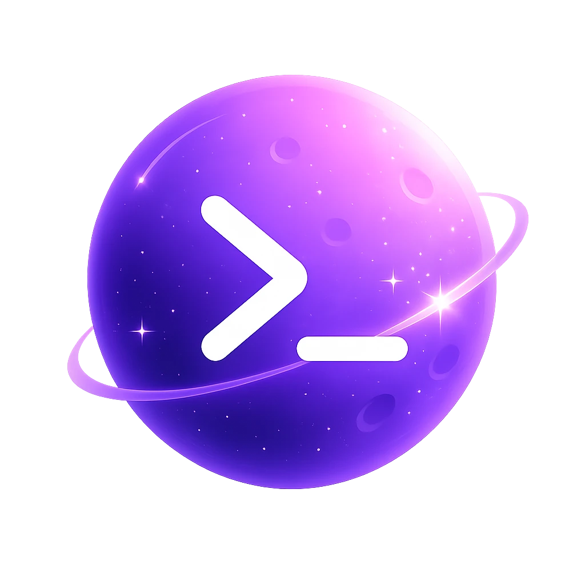
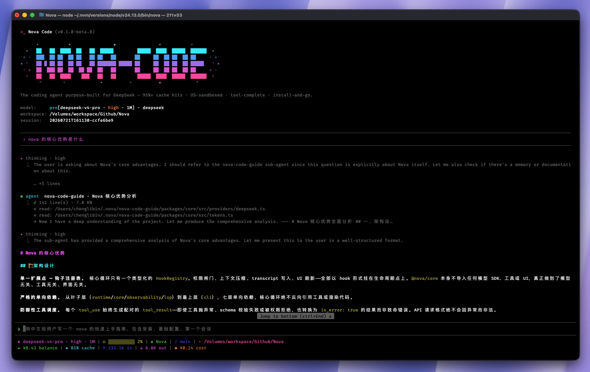
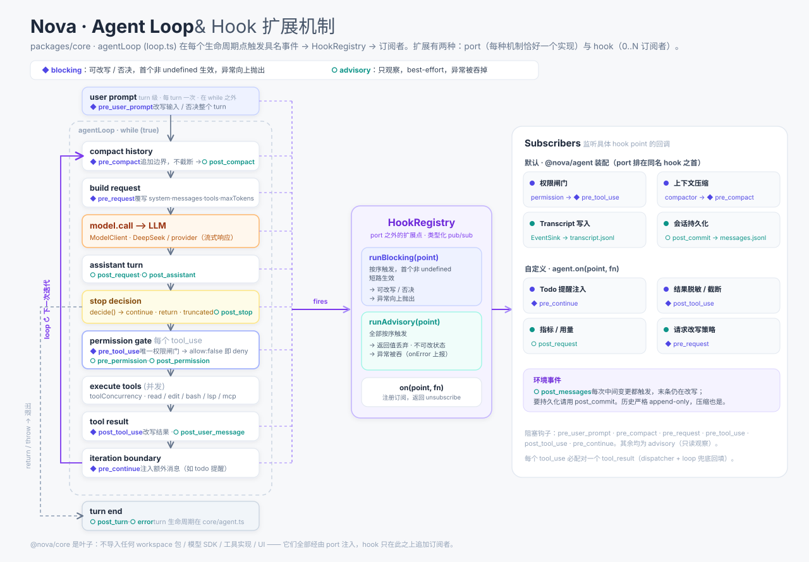

<div align="center">



<h1>NOVA&nbsp;CODE</h1>

<p><b>The Claude Code for Chinese LLMs</b></p>

<p>A finished product, not a framework kit — and the same task costs you the fewest tokens.</p>

<p><code>high cache hit rate</code> · <code>OS-sandboxed</code> · <code>tool-complete</code> · <code>install-and-go</code></p>

<p>
  <a href="https://www.npmjs.com/package/@asathinkeroops/nova-code"></a>
  
  
  <a href="LICENSE"></a>
</p>

<p>
  <a href="README.md">简体中文</a>
  &nbsp;·&nbsp;
  <b>English</b>
</p>

<p>
  <a href="#-why-nova"><b>Why Nova</b></a>
  &nbsp;•&nbsp;
  <a href="#-quick-start"><b>Quick Start</b></a>
  &nbsp;•&nbsp;
  <a href="#-features"><b>Features</b></a>
  &nbsp;•&nbsp;
  <a href="#-architecture"><b>Architecture</b></a>
  &nbsp;•&nbsp;
  <a href="docs/guide.md"><b>User Guide (ZH)</b></a>
  &nbsp;•&nbsp;
  <a href="#-development"><b>Development</b></a>
</p>

<br>



<br><sub>💬 Reads code, runs commands, edits files — drives your task to done in one terminal</sub>

</div>

<br>

Nova reads code, runs commands, edits files — and drives your task to done through tool use. It's a **finished product**, not a kit you assemble yourself: permissions, workspace trust, sandbox, LSP, MCP, Skills, plugins, and resumable sessions are all in place — install, drop in a key, get to work.

Model integration has two orthogonal dimensions: a **provider profile** handles thinking shape, error translation, retries, and balance probes, while the **transport** chooses the Anthropic Messages or OpenAI `chat/completions` wire. First-run setup currently connects DeepSeek's OpenAI-compatible endpoint by default; the same DeepSeek profile can switch to `/anthropic`, while Kimi, Qwen, GLM, MiniMax, Doubao, and other endpoints can be connected through built-in provider profiles or manual configuration. The whole request pipeline is designed around server-side automatic prefix caching, maximizing reuse of repeated context to reduce token cost.

<br>

## ✨ Why Nova

<table>
<tr>
<td width="50%" valign="top">

### ⚡ Native dual-protocol support, ready to run

No `cache_control` to tweak, no error-code docs to dig through. Install, drop in your key, go. Thinking is mapped per vendor and wire: DeepSeek uses `output_config.effort` on the Anthropic wire and `thinking.type` + `reasoning_effort` on the OpenAI wire; Kimi uses `thinking.type` on its Anthropic wire. HTTP failures become plain-language guidance with top-up / new-key links. DeepSeek, Qwen, GLM, MiniMax, Doubao, and other `chat/completions` endpoints use the native OpenAI transport without losing provider-specific error translation or balance probes.

</td>
<td width="50%" valign="top">

### 🎚️ Multi-provider, three-tier ladder

Three provider profiles are built in — DeepSeek, Moonshot (Kimi, beta), and generic Anthropic-compatible (`other`) — each with its own error table and rate-limit retries (DeepSeek and Kimi also probe account balance). First-run setup currently exposes only DeepSeek; other endpoints are configured manually. OpenAI-compatible endpoints reuse an existing vendor profile via `transport: "openai"`, not a separate provider. Models use `lite` / `pro` / `max` tiers, each with its own id, thinking, modalities, context window, and pricing.

</td>
</tr>
<tr>
<td width="50%" valign="top">

### 🚀 Cache-friendly by design

History is append-only and the request body stays byte-stable (internal `meta` fields are stripped before sending so they never pollute the prefix); memory and skills are rebuilt only at session boundaries, never mid-turn — maximizing reuse of the server-side automatic prefix cache across turns (DeepSeek and Kimi both use one). Auto-compaction fires at half the context window and only appends a `<compacted>` boundary.

</td>
<td width="50%" valign="top">

### 🔒 OS-level sandbox, one line to enable

Turn it on and subprocess (`bash` / background tasks) writes are confined to the workspace by an OS-level sandbox (macOS Seatbelt / Linux bubblewrap), layered on top of the permission engine — writes only; reads and network stay open. Off by default — flip `sandbox.enabled: true` (or `/sandbox on` in-session) to opt in; unsupported platforms degrade silently.

</td>
</tr>
<tr>
<td width="50%" valign="top">

### 🧩 Extend with markdown, package as plugins

Declare custom sub-agents, slash commands, and skills in Markdown; lifecycle shell hooks live in the global config or `.nova/hooks.json` / `.nova/hooks.local.json`. To share a whole bundle, install it as a plugin: `nova plugin install` supports local paths, GitHub, git URLs, and marketplaces in the Claude Code-compatible plugin format.

</td>
<td width="50%" valign="top">

### 🤖 Built for automation

`nova -p` runs one non-interactive turn and exits; in a non-TTY environment it can also read the prompt from stdin. `--output-format json|jsonl` emits a complete result or streamed events for scripts, CI, and git hooks. `/review <PR#>` reviews a GitHub PR read-only via `gh`; `cronCreate` schedules prompts; `/goal` keeps working toward an explicit success condition.

</td>
</tr>
<tr>
<td colspan="2" valign="top">

### 🔄 Bring your habits, not a manual

Nova closely mirrors the Claude Code workflow — the same slash commands, keybindings, approval prompts, three-layer memory files, and replayable sessions. If you've used Claude Code there's nothing new to learn: install and keep working the way you already do, just on an engine tuned for Chinese LLMs and designed around token cost underneath.

</td>
</tr>
</table>

<br>

## 🚀 Quick start

> [!NOTE]
> Requires **Node ≥ 20**

```bash
npm install @asathinkeroops/nova-code -g
nova                               # launch the REPL
nova "explain this repository"     # run an initial prompt, then stay in the REPL
nova -p "explain this code"        # headless: one turn, print & exit
echo "summarize the current diff" | nova --output-format jsonl
nova upgrade                       # update to the latest version (also auto-checked at startup)
```

First launch currently asks directly for a DeepSeek API key and writes a provider connection (`providers: [{ "name": "deepseek", "profile": "deepseek", "transport": "openai", "baseURL": "https://api.deepseek.com", "apiKey": "<key>" }]` with `currentProvider: "deepseek"`) and the default `pro` tier to `~/.nova/nova.config.json`. To keep the key out of that plaintext file, export `NOVA_API_KEY`; it overrides the current provider's `apiKey`, and setup never copies an environment key back to disk. The first time Nova enters a workspace, it also asks you to trust it; the trust record lives only in the user-level config.

Runtime settings only use the `providers` / `currentProvider` shape. When startup finds the former top-level `provider`, `baseURL`, `apiKey`, `models`, or `transport` fields, it performs a one-time atomic migration into a provider connection and writes the new shape back before parsing it.

Headless mode does not run the interactive setup flow. If the current provider has no effective API key or model table, or lacks the `baseURL` required by its transport/profile, Nova exits with a configuration error; run it interactively once or complete `providers` / `currentProvider` manually first.

DeepSeek's built-in ladder is `lite` → `deepseek-v4-flash-vision-exp` (image input), and `pro` / `max` → `deepseek-v4-pro`, with a different thinking depth on each tier. **Provider defaults are built into the code and never written to the config file**; the file carries only your overrides, so upgrades can deliver new model ids, prices, and context windows. `/model` persists the selected tier, while `--model` only overrides the current launch. `settings.locale` controls TUI text (bundled zh-CN / EN), while `settings.language` controls model replies and defaults to the system locale. See the [Chinese user guide](docs/guide.md) for more providers and the full configuration reference.

### 📦 More subcommands

<!-- prettier-ignore -->
| Subcommand | What it does |
| --- | --- |
| `nova doctor` | Health-check the global config |
| `nova mcp` | Add, inspect, remove, and OAuth-authenticate MCP servers |
| `nova plugin` | Install, uninstall, enable/disable plugins, and manage marketplaces |
| `nova upgrade` | Update the CLI |

<br>

## 🛠️ Features

### Built-in tools

Model-callable tools cover read/write, search, execution, code intelligence, and the web. The final set is built dynamically from settings, discovered Skills / LSP / MCP capabilities, and `permissions.deny`:

<!-- prettier-ignore -->
| Tool | Capability |
| --- | --- |
| `read` / `write` / `edit` | Read files (line-numbered + paginated, incl. `.xlsx/.xls/.xlsm/.xlsb/.ods` spreadsheets and `.pdf` documents), whole-file write, exact-text replace; images reach vision-capable tiers as user-image messages supported by both Anthropic and OpenAI transports (images over 2048px on their longest side are proportionally resized in-memory, leaving the original untouched) |
| `glob` / `grep` | Filename matching, full-text regex search |
| `bash` | Run shell commands; with `run_in_background: true` it detaches long tasks (dev servers, watchers) and returns an id, pid, and log path immediately |
| `killBackground` | Terminate a background command |
| `monitor` / `stopMonitor` | Watch scripts: every stdout line becomes a notification (`tail -f`, watchers, poll loops) |
| `lsp` | Code intelligence: go-to-definition, references, hover, diagnostics, symbol search |
| `webfetch` / `websearch` | Fetch web pages, search the web |
| `createTodo` / `updateTodo` / `getTodoList` / `clearTodoList` | In-session multi-step checklist |
| `createTask` / `updateTask` / `getTaskList` / `clearTaskList` | Cross-session task plan with dependencies |
| `askUserQuestion` | Ask the user multiple-choice questions and wait for answers |
| `createSubAgent` | Delegate to an `explore`, `plan`, `general-purpose`, or custom sub-agent with fresh context and its own tool set |
| `enterPlanMode` / `exitPlanMode` | The model puts itself into read-only plan mode to work out an approach, then asks you to approve the plan before it leaves and starts implementing. Even when it forgets to call `exitPlanMode`, nova raises the prompt itself once the turn ends — approving restores your previous mode and continues straight into the work |
| `cronCreate` / `cronList` / `cronDelete` | Schedule a prompt or `/command` on an interval or cron expression; live within a session and re-arm on `/resume` |
| `loadSkill` | Load a skill on demand |

### ⌨️ Built-in commands

<!-- prettier-ignore -->
| Command | Capability |
| --- | --- |
| `/help` | See all commands |
| `/model` · `/effort` | Persist the active model tier and its thinking level; an explicit numeric budget is session-only |
| `/compact` | Summarize long history |
| `/clear` · `/resume` · `/rewind` | Start sessions or resume history from the current workspace; rewind history with a previewed file-snapshot restore while preserving external changes as conflicts |
| `/rename` | Give the current session a custom name (shown on the input frame) |
| `/plan` | Investigate read-only and produce an implementation plan |
| `/goal` | Set a success condition and auto-work toward it until met |
| `/diff` · `/review` | Browse and review uncommitted changes; `/review <PR#\|#PR\|github-pr-url>` reviews a GitHub PR read-only via the `gh` CLI |
| `/init` | Analyze the codebase to generate `NOVA.md` |
| `/agents` · `/agent` | See sub-agent types, delegate a task |
| `/nova-code-guide` · `/nova-code-guide-update` | Read-only Q&A agent about Nova itself; the latter pulls the newest source |
| `/commands` · `/skills` · `/lsp` | Inspect or reload commands, and inspect skills and language servers |
| `/mcp` · `/plugin` | Authenticate/reconnect/log out MCP servers and inspect tools; inspect contributions loaded from plugins (installation and toggles use `nova plugin`) |
| `/sandbox` | Enable/disable the OS command sandbox for this session (`on` / `off`) |
| `/loop` | Re-run a prompt or command on an interval (`/loop <interval> <prompt\|/cmd>`, `/loop stop` to end) |
| `/doctor` | Health-check the global config (JSON/schema, model/key, hooks, MCP), report issues, optionally hand them to the agent to fix in place |
| `/usage` · `/context` | See token usage, cache hits, context fill |
| `/tasks` | View and manage background commands (`bash` + `run_in_background`) — list / stop; the active background-task count stays visible below the input |
| `/predict` | Toggle next-input prediction |
| `/exit` · `/quit` | Quit |

Each session is permanently bound to the workspace where it was created. `nova -c` and `/resume` only search sessions from the current workspace; `nova --resume <id>` and `/resume <id>` reject sessions from another workspace and report the directory they belong to.

### Core capabilities

<!-- prettier-ignore -->
| Capability | What it gives you |
| --- | --- |
| 🧠 Sub-agents | Work with fresh context and their own tool set: `explore` (read-only retrieval), `plan` (read-only planning), `general-purpose` (full access), `nova-code-guide` (Q&A about Nova), plus custom types; each agent can run on its own model tier via `subagent.model` |
| 🛡️ Permissions & sandbox | A workspace-trust gate runs before project code is loaded; the default `auto` mode uses static rules plus an optional small-model classifier for bash risk, while <kbd>shift</kbd>+<kbd>tab</kbd> cycles `default` / `acceptEdits` / `auto` / `plan`; an OS-level sandbox confines subprocess writes to the workspace (macOS Seatbelt / Linux bubblewrap), off by default |
| 📄 File guarding | Files must be read before they're edited, and external changes are detected — no accidental clobbering |
| 🔌 MCP | Connect `stdio` / `http` / `sse` servers; tools enter the normal permission gate, resources are exposed through read-only tools, prompts become slash commands, and remote servers support OAuth 2.0 + PKCE |
| 📚 Skills | Write reusable playbooks as `SKILL.md`, loaded on demand by the model — token-cheap and distributable with the repo |
| 📝 Declarative extensions | `.nova/commands/*.md`, `.nova/agents/*.md`, and `.nova/skills/*/SKILL.md` declare commands, sub-agents, and skills; `.nova/hooks.json` / `.nova/hooks.local.json` declare lifecycle shell hooks |
| 🧩 Plugins | `nova plugin` installs / enables / disables plugins from a local path, GitHub, git URL, or marketplace; one plugin can contribute commands, agents, skills, hooks, MCP / LSP servers, and `bin/`, in the Claude Code-compatible format; plugin loading is opt-in |
| 🗂️ Memory | Static memory layers global → user → project, choosing one file per layer by `NOVA.md` > `CLAUDE.md` > `AGENTS.md`; agent-maintained auto-memory is isolated per project and persists across sessions |
| 💻 TUI | Full-screen Ink/React REPL, streaming output + mouse; `@path` / `/` completion, `!command` shell passthrough, pasted/dropped images, <kbd>↑</kbd> <kbd>↓</kbd> history; status line with tokens, cache hits, provider balance, git branch, and context fill |
| 🌐 Multilingual | UI and model-reply language configured independently: `settings.language` drives the model's reply language (defaults to the system locale), `settings.locale` overrides the TUI's static text (bundled zh-CN / EN); the two can differ (e.g. Chinese UI + English replies), and an unsupported tag falls back to English |

<br>

## 🏗️ Architecture

Nova's kernel is `@nova/core`: the model loop (`agentLoop`) plus the turn lifecycle wrapped around it. It has **two extension mechanisms**, and the line between them matters — a **port** is a mechanism with exactly one implementation per agent (model, system prompt, tools, history, compaction, permission, logger, event sink); a **hook** is 0..N subscribers attached to 17 named lifecycle points that observe or lightly amend. A port is simply the built-in first node of its hook chain: `compactor.compact` runs before `pre_compact`, `permission.check` before `pre_tool_use`. `@nova/core` imports no workspace package, model SDK, tool implementation, or UI (enforced by eslint) — if it needs one, it declares a port and `@nova/agent` implements and assembles it. Blocking hooks (◆) can rewrite or veto a step; advisory hooks (○) only observe.

<div align="center">
  
</div>

### 📁 Repository layout

```
packages/
  core           agent kernel: port/hook contracts · agent loop · turn lifecycle · message types
  base           leaf foundation: config settings schema + model tables + cost · host logger/session/transcript/path-safety · prompt slash contract + expansion · text string utils
  model          Anthropic/OpenAI-compatible transports · provider profiles · retry
  agent          port implementations + assembly (assembleSession / assembleAgent) · static/auto memory + auto compact · sub-agents
  tools          ToolRegistry · dispatcher · built-in tools
  safety         PermissionEngine · file-access invariants · OS-level write sandbox
  mcp            MCP client (stdio / HTTP / SSE)
  lsp            LSP client/manager (JSON-RPC over stdio)
apps/
  cli            the `nova` binary (Ink/React REPL, only active app)
  http, vscode   placeholders, not yet implemented
eval/            replay harness + golden cases (excluded from main build)
docs/            design notes & user manual
```

Dependency direction: `base` / `core` / `lsp` are leaves (no `@nova/*` source imports); `safety` / `mcp` / `agent` / `model` → `core` + `base`; `tools` → `core` + `base` + `lsp`; `cli` depends on all of the above.

<br>

## 👩‍💻 Development

```bash
pnpm build                 # build all packages and apps (tsup, recursive)
pnpm typecheck             # tsc --noEmit across the workspace
pnpm test                  # vitest run
pnpm test:watch
pnpm vitest run path/to/file.test.ts
pnpm vitest run -t "name"
pnpm lint / pnpm lint:fix
pnpm format / pnpm format:check
```

Per-package scripts: `pnpm --filter @nova/<name> <script>`. Tests live next to source: `packages/*/src/**/*.test.ts(x)`.

New contributors should start with:

- `CLAUDE.md` — architecture invariants, loop contract, ESM conventions
- `nova-architecture.html` — architecture diagram and overview

<br>

---

<div align="center">

### 🧰 Built with

<p>
  
  
  
  
  
  
</p>

<br>

## 📜 License

[MIT](LICENSE) © Nova contributors.

<p>
  <a href="https://github.com/asathinkeroops/nova-code">🏠 Repository</a>
  &nbsp;·&nbsp;
  <a href="https://github.com/asathinkeroops/nova-code/issues">🐛 Report an issue</a>
  &nbsp;·&nbsp;
  <a href="https://www.npmjs.com/package/@asathinkeroops/nova-code">📦 npm</a>
</p>

<sub>Built for Chinese LLMs ❤️</sub>

<br><br>

<sub>If Nova helps you, consider leaving a ⭐ Star</sub>

</div>
