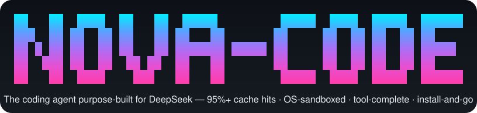

<p align="center">
  
</p>

[简体中文](README.md) · **English**


> The coding agent purpose-built for DeepSeek — 95%+ cache hits · OS-sandboxed · tool-complete · install-and-go. 

Nova reads code, runs commands, edits files — and drives your task to done through tool use. It's built around **DeepSeek**: thinking maps to effort (not `budget_tokens`), the wire format is auto-detected from the model id, and the entire request pipeline is tuned so DeepSeek's automatic context cache keeps hitting. Other Anthropic-compatible endpoints work too; DeepSeek gets first-class care.

## Why Nova

**DeepSeek-native, zero config.**
No `cache_control` to tweak, no wire format to guess, no error-code docs to dig through. Install, drop in your key, go. Thinking levels, cache hits, and error messages are all tuned for DeepSeek out of the box.

**Cache-friendly by design.**
History is append-only, keeping the byte-stable prefix DeepSeek's server-side cache depends on — faster responses, fewer tokens billed. Micro-compaction is off by default (it breaks the cache prefix); auto-compaction only fires under real window pressure.

**Sandbox-on, defense in depth.**
Subprocess writes are confined to the workspace by an OS-level sandbox (macOS Seatbelt / Linux bubblewrap), layered on top of the permission engine. Unsupported platforms degrade silently — you get protection with zero config.

**Extend with markdown.**
Define custom sub-agents, slash commands, skills, or lifecycle hooks — drop a `.md` file with frontmatter and you're done. No code changes, ships with the repo.

## Quick start

Requires **Node ≥ 20** and **pnpm 10.28.2**.

```bash
pnpm install
pnpm dev                           # launch the REPL
pnpm dev -p "explain this code"    # headless: one turn, print & exit
```

First launch walks through an interactive setup (API key, model, etc.) → `~/.nova/nova.config.json`.

## Features

**Agent loop**
- Multi-turn tool use with bounded concurrency (default 3)
- Sub-agents with fresh context — `explore`, `plan`, `general-purpose`, plus custom `.md` types
- Plan mode — `/plan` runs a read-only investigation before touching anything
- Resumable sessions with append-only persistence, `/rewind` to roll back
- `/model` to switch models mid-session; `/compact` to summarize long history

**Code intelligence**
- LSP tool — go-to-definition, references, hover, diagnostics, workspace symbols (scope- and type-aware)
- `read` (line-numbered + paginated, with `.xlsx` / `.ods` support), `write`, `edit`
- `glob` + `grep` search, `webfetch` + `websearch`

**Safety**
- Permission engine — one-key mode cycling (shift+tab: `default` → `acceptEdits` → `plan`)
- OS-level sandbox — write confinement, network open, default-on, auto-degrade
- Lifecycle hooks — shell-scriptable events for auto-formatting, tool guarding, context injection

**Extensibility**
- Custom sub-agents — drop a `.md` into `.nova/agents/`, declare tools & model in frontmatter
- Custom slash commands — `.md` files in `.nova/commands/`
- Skills — `SKILL.md` files discovered on startup, pulled on demand via `loadSkill`
- MCP — connect external servers (stdio / HTTP / SSE), bridge tools to the model

**TUI**
- Full-screen Ink/React REPL with live streaming output & mouse support
- `!` shell escape — `!git status` runs locally, no permission prompt
- `@path` fuzzy autocomplete
- Live status line — token usage, cache hit rate, estimated cost, DeepSeek account balance

## Architecture

At Nova's core is a single model loop (`agentLoop`) with **one extension point** — a typed `HookRegistry`. Permission gating, compaction, transcript writing, and UI updates all attach as hooks at named lifecycle points; `@nova/core` itself imports no model SDK, tool implementation, or UI. Blocking hooks (◆) can rewrite or veto a step; advisory hooks (○) only observe.


## Repository layout

```
packages/
  core           agent loop · model client · HookRegistry · message/stop-reason types
  agent          createAgent: per-turn driver + persistence + transcript wiring
  runtime        settings (zod) · pino logger · session storage
  tools          ToolRegistry · dispatcher · built-in tools
  subagent       createSubAgent tool · sub-agent definitions/registry/loader
  context        3-layer memory (NOVA.md > CLAUDE.md > AGENTS.md) · auto compact
  safety         PermissionEngine · approval prompts
  sandbox        OS-level command sandbox (write isolation)
  lsp            LSP client/manager (JSON-RPC over stdio)
  external       SlashRegistry · .md command loader · MCP client
  observability  Transcript (JSONL)
apps/
  cli            the `nova` binary (Ink/React REPL, only active app)
  http, vscode   placeholders, not yet implemented
eval/            replay harness + golden cases (excluded from main build)
docs/            design notes & user manual
```

Dependency direction: `runtime` / `core` / `observability` / `lsp` are leaves (no `@nova/*` source imports); `safety` → `runtime`; `context` → `core` + `runtime`; `tools` → `core` + `runtime` + `lsp`; `sandbox` / `external` → `core` (type-only); `agent` → `core` + `runtime` + `context` + `observability`; `subagent` → `agent` + `context` + `core` + `observability` + `runtime`; `cli` depends on all of the above.

## Development

```bash
pnpm build                 # build all packages and apps (tsup, recursive)
pnpm typecheck             # tsc --noEmit across the workspace
pnpm test                  # vitest run
pnpm test:watch
pnpm vitest run path/to/file.test.ts
pnpm vitest run -t "name"
pnpm lint / pnpm lint:fix
pnpm format / pnpm format:check
```

Per-package scripts: `pnpm --filter @nova/<name> <script>`. Tests live next to source: `packages/*/src/**/*.test.ts(x)`.

New contributors should start with:
- `CLAUDE.md` — architecture invariants, loop contract, ESM conventions
- `agent-harness-loop-architecture.html` — architecture diagram and overview

## License

[MIT](LICENSE) © Nova contributors.
